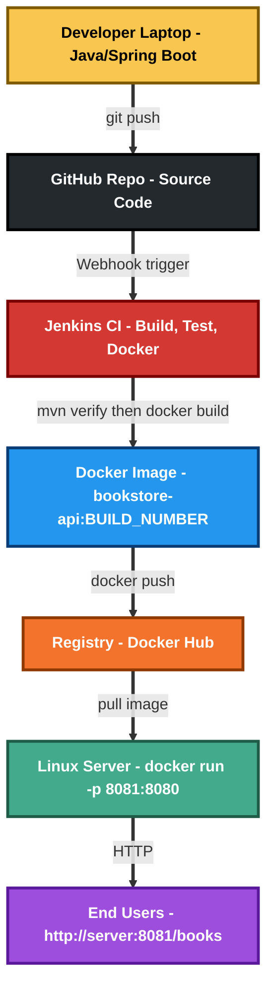

# bookstore-api

[](https://github.com/yashasravi21/bookstore-api/actions/workflows/ci.yml)

A Spring Boot REST API for a small book catalogue, built into a Docker image with a multi-stage build and deployed by a Jenkins pipeline.

The focus of this repository is the build and release process: reproducible image builds that need no local JDK, automated tests that gate the pipeline, and a health-checked container deploy.

---

## API endpoints

| Endpoint | Method | Purpose |
| --- | --- | --- |
| `/books` | GET | Returns all books as JSON |
| `/books` | POST | Adds a book (JSON body: `id`, `title`, `author`) |
| `/actuator/health` | GET | Health check used by Docker and the CI smoke test |

Example:

```bash
curl http://localhost:8081/books

curl -X POST http://localhost:8081/books \
  -H "Content-Type: application/json" \
  -d '{"id":3,"title":"Docker Deep Dive","author":"Nigel"}'
```

---

## Tech stack

- **Runtime:** Java 17, Spring Boot 3.5
- **Build:** Maven, Spring Boot Actuator for health endpoints
- **Container:** Multi-stage Docker build (Maven builder → JRE Alpine runtime), non-root user, `HEALTHCHECK`
- **CI/CD:** Jenkins declarative pipeline + GitHub Actions
- **Testing:** JUnit 5 with MockMvc

---

## Architecture



---

## Run it locally

**With Docker — no JDK or Maven needed on your machine:**

```bash
git clone https://github.com/yashasravi21/bookstore-api.git
cd bookstore-api

docker build -t bookstore-api:latest .
docker run -d --name bookstore-api -p 8081:8080 bookstore-api:latest

curl http://localhost:8081/actuator/health
curl http://localhost:8081/books
```

**With Maven:**

```bash
mvn clean verify        # compiles and runs the tests
mvn spring-boot:run     # starts on http://localhost:8080
```

---

## Why the build is multi-stage

The first stage uses a `maven` image to compile the jar. The second stage copies only the finished jar into a slim JRE image and throws the build tools away.

This matters for two reasons:

1. **The build is self-contained.** Anyone can run `docker build` without installing Java or Maven, and CI does not need a separate build step before the image build.
2. **The runtime image is much smaller**, because a JDK, Maven and the local `.m2` cache never reach the final image.

The `pom.xml` is copied before the source so the downloaded dependency layer stays cached until dependencies actually change.

---

## CI/CD pipeline

**GitHub Actions** (`.github/workflows/ci.yml`) on every push to `main`:

1. `mvn clean verify` — compiles and runs the JUnit tests
2. Uploads the built jar as a workflow artifact
3. Builds the Docker image, starts the container, and verifies `/actuator/health` and `/books` respond

**Jenkins** (`Jenkinsfile`) does the same and then deploys:

| Stage | What happens |
| --- | --- |
| Checkout | Pulls the triggering branch |
| Build & Test | `mvn -B clean verify`, publishes the JUnit report and archives the jar |
| Build Docker Image | Tags with the Jenkins build number and `latest` |
| Deploy Container | Replaces the running container, maps host `8081` → container `8080` |
| Smoke Test | Polls `/actuator/health` for up to 90 seconds, then calls `/books`; dumps container logs and fails the build if it never comes up |

<!-- Add your own screenshot: put the file in docs/ and uncomment the line below. -->
<!--  -->

---

## Project structure

```
.
├── .github/workflows/ci.yml
├── Dockerfile                                  # Multi-stage build
├── Jenkinsfile                                 # Build, test, deploy, smoke test
├── pom.xml
└── src
    ├── main/java/com/example/bookstore/        # Application, controller, model
    ├── main/resources/application.properties
    └── test/java/com/example/bookstore/        # MockMvc tests
```

---

## Known limitation

Books are held in an in-memory list, so data is lost when the container restarts. Adding a database and a persistent volume is the next planned step.

---

## Author

**Yashas R** — Bengaluru, India
[LinkedIn](https://www.linkedin.com/in/yashas-r-66336a3b5/) · yashasravi2101@gmail.com
