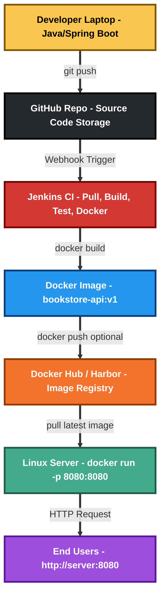

```mermaid
flowchart TD
    A["Developer Laptop - Java/Spring Boot"]
    B["GitHub Repo - Source Code Storage"]
    C["Jenkins CI - Pull, Build, Test, Docker"]
    D["Docker Image - bookstore-api:v1"]
    E["Docker Hub / Harbor - Image Registry"]
    F["Linux Server - docker run -p 8080:8080"]
    G["End Users - http://server:8080"]

    A ==>|git push| B
    B ==>|Webhook Trigger| C
    C ==>|docker build| D
    D ==>|docker push optional| E
    E ==>|pull latest image| F
    F ==>|HTTP Request| G

    classDef dev fill:#f9c74f,stroke:#7f5a00,stroke-width:3px,color:#000,font-weight:bold
    classDef github fill:#24292e,stroke:#000,stroke-width:3px,color:#fff,font-weight:bold
    classDef jenkins fill:#d33833,stroke:#7a0000,stroke-width:3px,color:#fff,font-weight:bold
    classDef docker fill:#2496ed,stroke:#0a3d75,stroke-width:3px,color:#fff,font-weight:bold
    classDef registry fill:#f3722c,stroke:#8f3a00,stroke-width:3px,color:#fff,font-weight:bold
    classDef server fill:#43aa8b,stroke:#1f5c47,stroke-width:3px,color:#fff,font-weight:bold
    classDef users fill:#9d4edd,stroke:#5a189a,stroke-width:3px,color:#fff,font-weight:bold

    class A dev
    class B github
    class C jenkins
    class D docker
    class E registry
    class F server
    class G users
```
